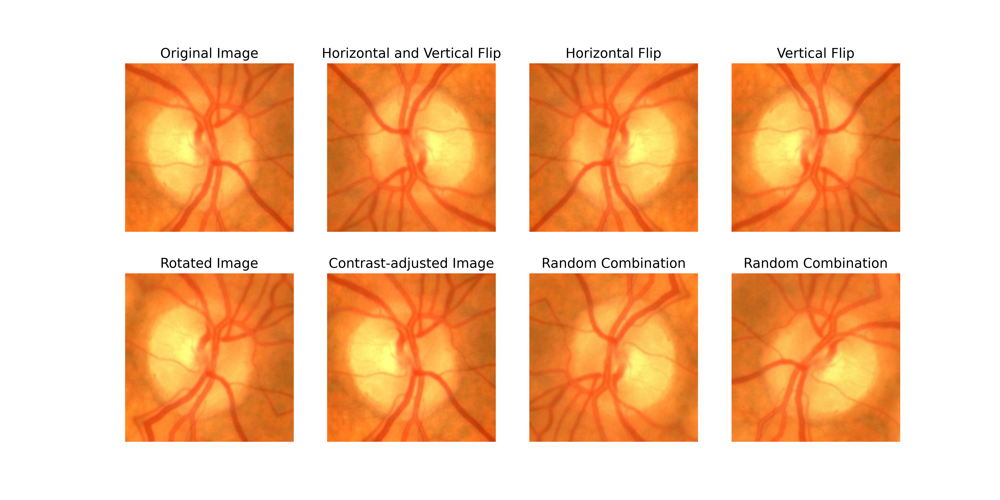
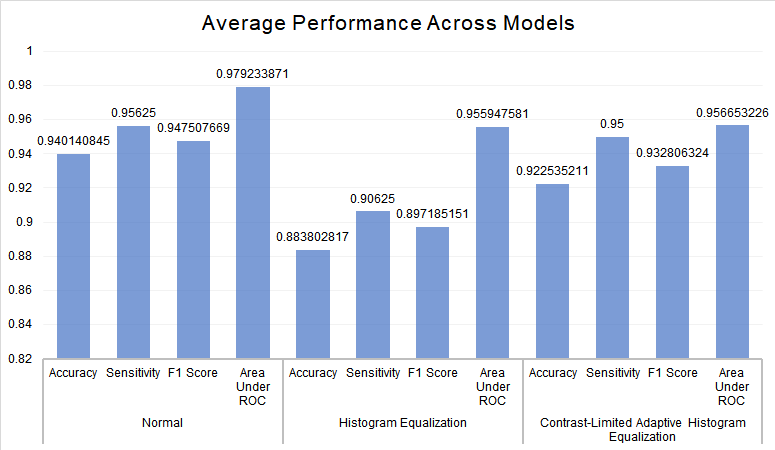

# A Comparative Study on Deep Convolutional Neural Networks and Histogram Equalization Techniques for Glaucoma Detection From Fundus Images

Using CNNs to classify an image into normal or glaucomatous, using retinal fundus images by transfer learning, and evaluating 2 histogram equalisation-based image preprocessing techniques. This project was a collaboration with [H Shafeeq Ahmed](https://orcid.org/0000-0003-1671-8474).

Read our paper [here](paper.pdf).

The dataset used is [ACRIMA](https://figshare.com/s/c2d31f850af14c5b5232), containing 705 labelled images: _396_ glaucomatous images and _309_ normal images.

## Model Comparison

The CNN models were fit using 70% of the dataset for training, 10% for validation and 20% for testing.

The model architecture used is as follows:

- An input layer (256, 256, 3)
- A data augmentation layer
- The base model with _image-net_ weights
- A flatten layer
- A dense layer with _ReLU_ activation
- A 0.5 dropout layer
- A dense output layer with _softmax_ activation

Data augmentation involved random change in contrast, flip along horizontal or vertical, rotation, and translation of the images:

The notebooks can be accessed in the [notebooks folder](notebooks) folder of this repo. Here is an example of the notebook used for training a model based on VGG-19 using CLAHE for image preprocessing: [notebook](notebooks/v16/clahe/clahe.ipynb).

### Results

|     Model             |     Accuracy    |     Specificity    |     Sensitivity    |     F1 Score    |     Area Under ROC    |     Number of Parameters    |
|-----------------------|-----------------|--------------------|--------------------|-----------------|-----------------------|-----------------------------|
|     VGG-16            |     0.9718      |     0.9516         |     0.9875         |     0.9753      |     0.9978            |     2,31,04,066             |
|     VGG-19            |     0.9789      |     0.9677         |     0.9875         |     0.9814      |     0.9933            |     2,84,13,762             |
|     ResNet-50         |     0.9577      |     0.9839         |     0.9375         |     0.9615      |     0.9956            |     5,71,42,914             |
|     ResNet-152        |     0.9507      |     0.9839         |     0.925          |     0.9548      |     0.9944            |     9,19,26,146             |
|     Inception v3      |     0.9085      |     0.8871         |     0.925          |     0.9193      |     0.9364            |     4,06,77,922             |
|     Xception          |     0.9296      |     0.9516         |     0.9125         |     0.9359      |     0.9794            |     5,44,16,682             |
|     DenseNet-121      |     0.9577      |     0.9516         |     0.9625         |     0.9625      |     0.9960            |     2,38,15,490             |
|     EfficientNetB7    |     0.9225      |     0.8871         |     0.95           |     0.9325      |     0.9625            |     10,60,41,497            |

## Preprocessing Techniques Comparison

Two different preprocessing techniques were compared:
- Adaptive Histogram Equalisation
- Contrast-Limited Adaptive Histogram Equalisation

### Results

#### I. Histogram Equalisation

| Model          | Accuracy    | Specificity | Sensitivity | F1 Score    | Area Under ROC | Number of Parameters |
|----------------|-------------|-------------|-------------|-------------|----------------|----------------------|
| VGG-16         | 0.943661972 | 0.935483871 | 0.95        | 0.95        | 0.993548387    | 23104066             |
| VGG-19         | 0.894366197 | 0.951612903 | 0.85        | 0.900662252 | 0.978427419    | 28413762             |
| ResNet-50      | 0.936619718 | 0.951612903 | 0.925       | 0.942675159 | 0.991935484    | 57142914             |
| ResNet-152     | 0.936619718 | 0.967741935 | 0.9125      | 0.941935484 | 0.98891129     | 91926146             |
| Inception v3   | 0.767605634 | 0.870967742 | 0.6875      | 0.769230769 | 0.846774194    | 40677922             |
| Xception       | 0.767605634 | 0.903225806 | 0.6625      | 0.762589928 | 0.898387097    | 54416682             |
| DenseNet-121   | 0.929577465 | 0.887096774 | 0.9625      | 0.93902439  | 0.985080645    | 23815490             |
| EfficientNetB7 | 0.838028169 | 0.822580645 | 0.85        | 0.855345912 | 0.926814516    | 106041497            |

#### II. Contrast-Limited Adaptive Histogram Equalisation

| Model          | Accuracy    | Specificity | Sensitivity | F1 Score    | Area Under ROC | Number of Parameters |
|----------------|-------------|-------------|-------------|-------------|----------------|----------------------|
| VGG-16         | 0.922535211 | 1           | 0.8625      | 0.926174497 | 0.996572581    | 23104066             |
| VGG-19         | 0.922535211 | 1           | 0.8625      | 0.926174497 | 0.996572581    | 28413762             |
| ResNet-50      | 0.929577465 | 0.870967742 | 0.975       | 0.939759036 | 0.983770161    | 57142914             |
| ResNet-152     | 0.957746479 | 0.935483871 | 0.975       | 0.962962963 | 0.994153226    | 91926146             |
| Inception v3   | 0.809859155 | 0.774193548 | 0.8375      | 0.832298137 | 0.91733871     | 40677922             |
| Xception       | 0.781690141 | 0.935483871 | 0.6625      | 0.773722628 | 0.921169355    | 54416682             |
| DenseNet-121   | 0.950704225 | 0.935483871 | 0.9625      | 0.956521739 | 0.987701613    | 23815490             |
| EfficientNetB7 | 0.894366197 | 0.838709677 | 0.9375      | 0.909090909 | 0.925604839    | 106041497            |

#### III. Comparing the Averages of Models

